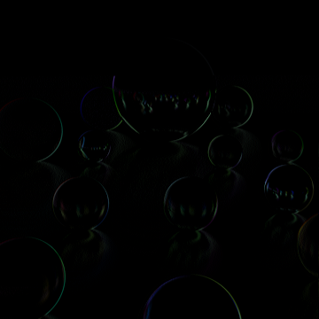
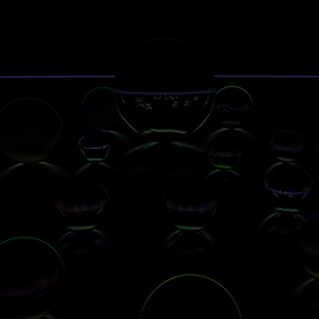
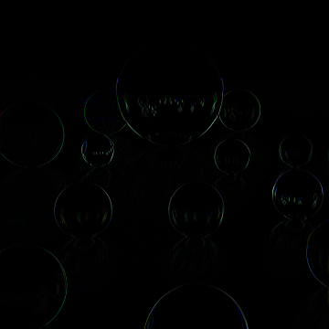
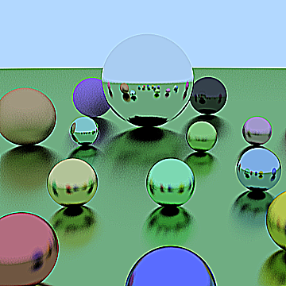

# OpenCV(Python)を用いた実装

## 【基本事項】

### ⓪ モジュールの指定

```python
import cv2
import numpy as np
```

### ① 画像の読み込み

```python
# パスを指定
path = "../image/sample.png"

# 画像を読み込み
img = cv2.imread(path)
```

### ② 画像の表示

```python
cv2.imshow('タイトル名', img)
cv2.waitKey(0) #キー入力があるまで表示
```

### ② 画像の保存

```python
cv2.imwrite('../image/save.jpg', img)
```

### 画素へのアクセス

Python での for 文は遅いため非推奨。学習用としての理解に留める

```python
# 画像の高さ、横幅、チャンネル数を取得
height, width, channels = img.shape[:3]

# 3重ループで直接画素にアクセス
for y in range(height):
    for x in range(width):
        for c in range(channels):
            img[y, x, c] = 100 #画素値を入力
```

## 【フィルタリング】

### 学習用サンプル

5 重ループなので非推奨。あくまで学習用

```python
# カーネルを生成
kernel = np.full((3, 3), 1/9)
kernel_y = len(kernel)
kernel_x = len(kernel[0])
N = int(kernel_y/2)
M = int(kernel_x/2)

# 5重ループにより畳み込み
H, W, channels = img.shape[:3]
copy = np.zeros((H, W, channels), np.uint8)
for y in range(N, H-N):
    for x in range(M, W-M):
        for c in range(channels):
            for py in range(-N, N+1):
                for px in range(-M, M+1):
                    copy[y, x, c] += img[y+py, x+px, c] * kernel[py+N, px+M]
img = copy
```

### 通常利用

実行速度の観点から、通常はこちらを使用

```python
# カーネルを生成
kernel = np.full((3, 3), 1/9)

# 畳み込み
img = cv2.filter2D(img, -1, kernel)
```

### フィルタ一覧

#### 元画像


#### 平滑化

```python
kernel = np.array([
    [1/9, 1/9, 1/9],
    [1/9, 1/9, 1/9],
    [1/9, 1/9, 1/9]
])
```


#### 加重平均

```python
kernel = np.array([
    [1/16, 2/16, 1/16],
    [2/16, 4/16, 2/16],
    [1/16, 2/16, 1/16]
])
```


#### 微分フィルタ

横方向

```python
kernel = np.array([
    [0,  0,  0],
    [0, -1,  1],
    [0,  0,  0]
])
```



縦方向

```python
kernel = np.array([
    [0,  1,  0],
    [0, -1,  0],
    [0,  0,  0]
])
```



#### プリューウィットフィルタ(Prewitt Filter)

```python
kernel = (1/6) * np.array([
    [-1, 0, 1],
    [-1, 0, 1],
    [-1, 0, 1]
])
```


#### ソーベルフィルタ(Sobel Filter)

```python
kernel = (1/8) * np.array([
    [-1, 0, 1],
    [-2, 0, 2],
    [-1, 0, 1]
])
```


#### ラプラシアンフィルタ(Laplacian Filter)

```python
kernel = np.array([
    [0,  0,  0],
    [1, -2,  1],
    [0,  0,  0]
])
```



#### 先鋭化フィルタ(Sharpening Filter)

```python
kernel = np.array([
    [-1, -1, -1],
    [-1,  9, -1],
    [-1, -1, -1]
])
```


